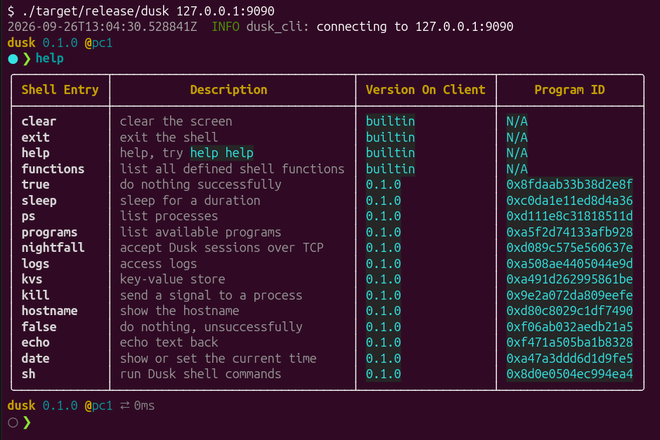

# Dusk

## Docs

[Click here](https://tomerze.github.io/dusk)

## Quick start

Configure, build, and run a standalone Dusk node for linux.

```bash
cmake -S artifacts/dusk_node --preset nix-x64-linux # Configure
make -C artifacts/dusk_node/build/nix-x64-linux dusk_node_bin # Build
./artifacts/dusk_node/build/nix-x64-linux/bin/dusk_node # Run
```

Build a Dusk CLI client for that node, and use it to connect to the running node.

```bash
cargo build --release -p dusk_cli_bin # Build
./target/release/dusk 127.0.0.1:9090 # Connect
```



## Contributing

Contributions are welcome under the [Contributor Assignment Agreement](docs/docs/legal/cla.md);
see [CONTRIBUTING.md](CONTRIBUTING.md) for how to make a change and
[GOVERNANCE.md](GOVERNANCE.md) for how the project is run. Vulnerabilities go
through [SECURITY.md](SECURITY.md), not the issue tracker.

## License

Copyright (C) 2023-2026 Tomer Zeitune

Dusk is free software: you can redistribute it and/or modify it under the
terms of the GNU Affero General Public License as published by the Free
Software Foundation, version 3 of the License only.

Dusk is distributed in the hope that it will be useful, but WITHOUT ANY
WARRANTY; without even the implied warranty of MERCHANTABILITY or FITNESS FOR
A PARTICULAR PURPOSE. See the GNU Affero General Public License in
[LICENSE](LICENSE) for more details.

Third-party material keeps its own license: the Cap'n Proto compiler under
`vendor/capnproto` (MIT).
