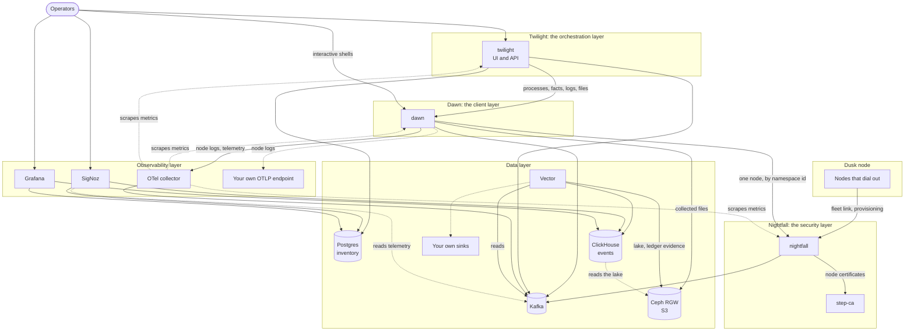

# The Dusk stack

This page is for the people who run the Dusk stack and for the people who review
its security. It says what the stack is made of, layer by layer, which part
talks to which and over what, and how work an operator asks for reaches a node.
Every other page of this section goes deeper into one part.

The Dusk stack is the set of services that manages a fleet - the nodes running
Dusk - from one place. It runs on Kubernetes, on your own infrastructure, or on
one machine with Docker Compose. Every node dials out to **nightfall** and keeps
one connection open; **dawn** does work on the nodes through nightfall;
**twilight** keeps the inventory of every node and decides, through campaigns,
what each node should run and be; the data layer keeps every event and the
observability layer shows it.

## The layers

From the top:

| Layer | What it does | Components | Pages |
|-------|--------------|------------|-------|
| **Dusk node** | A `dusk_node` whose init script runs `nightfall -c`, the node's connect mode (pull request #174, in review on `master`). It dials out to nightfall, proves who it is with its certificate and serves its `Dusk` capability over that link. | `artifacts/dusk_node`, `base/nightfall`; image `infra/node/Dockerfile` | [Nodes that dial out](nodes.md) |
| **Nightfall**, the security layer | The front door. Terminates the nodes' mutual TLS, enrolls nodes and renews their certificates through step-ca, serves each node to dawn behind a membrane that enforces permissions and limits, and writes every call to the ledger. | nightfall (`services/nightfall/`, Rust); step-ca, the fleet-client certificate authority | [nightfall](nightfall.md), [provisioning](provisioning.md), [the membrane](membrane.md), [the ledger](ledger.md) |
| **Dawn**, the client layer | Does work on nodes: runs processes, reads facts, streams logs, collects files, opens interactive shells. It is the `dusk` Python extension and `dusk.gw` made into a service, and the only client of nightfall's inner listener. | dawn (`services/dawn/`, Python) | [dawn](dawn.md), [processes](processes.md) |
| **Twilight**, the orchestration layer | The engine: inventory, campaigns, health gates, alerts, and reconcile - the check of the ledger against the processes twilight intended. Serves the web UI and its API. | twilight (`services/twilight/`, Go), its UI (`services/twilight/web/`, React) | [twilight](twilight.md), [campaigns](campaigns.md), [the UI](ui.md) |
| **Data layer** | Carries every event between the services and keeps it: Kafka is the bus, Vector copies it on. | Kafka; Vector; ClickHouse, the events database; Postgres, the inventory database; Ceph RGW, the S3 object store; any sink you connect to Vector | [Deploying](deploy.md) |
| **Observability layer** | Telemetry and dashboards. | The OTel collector; SigNoz; Grafana; your own OTLP endpoint | [Deploying](deploy.md) |

What the data layer keeps where:

| Store | What it holds |
|-------|---------------|
| Kafka | Every event and the ledger, as JSON messages that match the schemas in `services/contracts/kafka/`, and telemetry, as the OTLP JSON the OTel collector writes. |
| ClickHouse, the events database | The queryable copy of the events, the ledger and telemetry, and views over the Parquet lake. |
| Postgres, the inventory database | twilight's inventory, campaigns, intended processes and alerts; SigNoz's metadata. |
| Ceph RGW, S3 | The object-locked evidence copy of the ledger, the Parquet lake that is the events database's bulk storage, the files dawn collects, and SigNoz's cold tier. |
| Your own sinks | Vector reads every topic; add a sink to its configuration (`infra/vector/`) to copy events anywhere Vector can write. |

How to run all of it is on [Deploying the Dusk stack](deploy.md).

## How they connect

Each arrow points from the side that opens the connection to the side that
accepts it. The dashed arrows mark links that the components' descriptions do
not make obvious: the OTel collector scrapes the services' metrics, SigNoz reads
telemetry straight from Kafka, ClickHouse reads the lake in the object store -
which is how Grafana and SigNoz reach the data kept there - and dawn streams
node logs to any OTLP endpoint it is allowed to, yours included.

| From | To | Protocol | What for |
|------|----|----------|----------|
| Dusk node | nightfall | TLS 1.3 with the node's certificate, Cap'n Proto RPC; the node is the RPC server | The fleet link, to `fleet.<domain>`. The node serves its `Dusk`; nightfall serves the node nothing of its own. |
| Dusk node | nightfall | TLS 1.2 or 1.3, Cap'n Proto RPC | Enrollment and renewal, to `provision.<domain>`, usually on the same port as the fleet link. |
| nightfall | step-ca | HTTPS | Signing a node's certificate request with a one-time token nightfall mints. |
| nightfall | Kafka | Kafka protocol | Writes `dusk.ledger`, `dusk.connections`, `dusk.census`, `dusk.enrollments`, `dusk.credential-quota`; reads `dusk.node-state`, `dusk.census`, `dusk.connections`, `dusk.credential-quota`. |
| nightfall | nightfall | The client's own TLS, relayed after a PROXY protocol v2 header | A client that reached an instance not holding its node is relayed to the instance that does. |
| dawn | nightfall | TLS 1.3 with dawn's principal certificate, Cap'n Proto RPC | Reaching one node, by the server name `<namespace id>.<suffix>`. The `dusk` Python extension runs inside dawn and is the client of this link. |
| dawn | Kafka | Kafka protocol | Writes `dusk.process-results`, `dusk.process-output`, `dusk.files`. |
| dawn | Ceph RGW | S3 over HTTP(S) | Uploads the files it collects from nodes. |
| dawn | OTel collector, or your own OTLP endpoint | OTLP | Node logs it was asked to stream, to an endpoint its configuration allows; its own traces and logs. |
| twilight | dawn | HTTPS with twilight's client certificate | Dispatching processes, reaping them, reading facts, starting log streams and file collections. |
| twilight | Kafka | Kafka protocol | Reads `dusk.connections`, `dusk.census`, `dusk.ledger`, `dusk.enrollments`, `dusk.process-results`; writes `dusk.node-state`. |
| twilight | Postgres | PostgreSQL protocol | The inventory, campaigns, intended processes and alerts. |
| OTel collector | Kafka | Kafka protocol | Writes `dusk.otel-logs`, `dusk.otel-spans`, `dusk.otel-metrics`. |
| OTel collector | nightfall, dawn, twilight | HTTP | Scrapes their Prometheus metrics: nightfall on 9100, dawn on 9101, twilight on 9102. |
| Vector | Kafka | Kafka protocol | Reads every topic but `dusk.census`, `dusk.node-state` and `dusk.credential-quota`; the ledger with `isolation.level=read_committed`. |
| Vector | ClickHouse | HTTP | One table per topic. |
| Vector | Ceph RGW | S3 | The Parquet lake (`dusk-lake`) and the ledger's evidence copy (`dusk-ledger-evidence`), with credentials that may only add objects to the evidence bucket. |
| ClickHouse | Ceph RGW | S3 | Views over the Parquet lake, and SigNoz's cold storage tier (`signoz-cold`). Grafana and SigNoz reach the object store only this way. |
| SigNoz | Kafka | Kafka protocol | Its ingester reads the three `dusk.otel-*` topics as consumer group `signoz`. |
| SigNoz | ClickHouse, Postgres | | Its data in the shared ClickHouse; its metadata in the `signoz` database. |
| Grafana | Postgres, ClickHouse | | Read-only access to the inventory and to ClickHouse. |

Operators sign in to twilight's UI and API, and open interactive shells on
nodes through dawn at a pid twilight records for them.

### Kafka topics

| Topic | Written by | Read by |
|-------|------------|---------|
| `dusk.connections` | nightfall | twilight, nightfall, Vector |
| `dusk.census` | nightfall | twilight, nightfall |
| `dusk.ledger` | nightfall | twilight, Vector |
| `dusk.enrollments` | nightfall | twilight, Vector |
| `dusk.node-state` | twilight | nightfall |
| `dusk.intended-processes` | twilight | nightfall |
| `dusk.credential-quota` | nightfall | nightfall |
| `dusk.process-results` | dawn | twilight, Vector |
| `dusk.process-output` | dawn | Vector |
| `dusk.files` | dawn | Vector |
| `dusk.otel-logs`, `dusk.otel-spans`, `dusk.otel-metrics` | OTel collector | Vector, SigNoz |

Every message on the nine topics above the telemetry ones is one JSON object
that matches its topic's schema in `services/contracts/kafka/`, and every
consumer of them validates each message it reads and drops one that does not
match. The `dusk.otel-*` topics carry OTLP JSON as the OTel collector writes
it, and have no schema there. No service creates a topic: the `kafka-init` job
creates them in the local stack and the dev overlay, and Strimzi's
`KafkaTopic` resources do in the prod overlay.

## How work reaches a node

Work on a node is a process at a pid ([Processes](processes.md) has the
details).

1. **twilight decides.** A campaign's selector matches a node that is online and
   due, or an operator asks for something on one node. twilight picks the pid -
   derived from the campaign, the node and the attempt for campaign work,
   random for anything else - records it in its `intended_processes` table, and
   writes it to `dusk.intended-processes`, waiting for Kafka to acknowledge it,
   before it calls dawn.
2. **twilight hands it to dawn.** It calls dawn with the node - device id,
   installation id, and the namespace id and nightfall instance of its current
   session, learned from `dusk.connections` and `dusk.census` - and the work:
   the pid, the script and what to collect afterwards.
3. **dawn connects through nightfall.** dawn connects to nightfall's inner
   listener with the server name `<namespace id>.<suffix>`, and nightfall hands
   it a `Dusk` of that node behind the membrane. From here on every call dawn
   makes is checked against dawn's permissions and against the processes
   twilight intends on that node - a call none of them allows is refused with
   `denied: not intended` - written to the ledger with the pid it works under
   and who asked for that process - a command before it is forwarded - and only
   then passed to the node.
4. **dawn checks the node's process table.** In the node's default shell it runs
   `ps`. A process already at the pid means the work was dispatched before:
   dawn reports `duplicate` and runs nothing.
5. **The node runs it in a shell of its own.** Otherwise dawn puts a shell
   server at the pid, through the `dusk` Python extension's `sh_server_pid`, and
   runs the script there. Once the script is over - it succeeded or failed, or
   the node's logs show it ended - dawn kills that shell; the exited process
   stays in the node's process table, so a resend is found there and not run
   again, until twilight has it reaped.
6. **The outcome comes back.** dawn writes the output to `dusk.process-output`
   and the result to `dusk.process-results`; twilight applies the result to the
   campaign and its health gates.
7. **twilight checks the ledger.** Reconcile reads every call nightfall
   forwarded, as recorded in `dusk.ledger`, and checks it against the intended
   processes, and checks the ledger's hash chain and signed checkpoints. nightfall
   already refused what was not intended, so a process no campaign or operator
   asked for in the ledger means a call got past that - the most important alert
   in the stack.

## Where to go next

* [Identity and trust](identity.md) - the device id, installation id and
  namespace id, the node certificate, and the three certificate authorities.
* [Nodes that dial out](nodes.md) - building a node that joins the fleet.
* [Processes](processes.md) - how work runs on a node, once.
* [Provisioning](provisioning.md), [nightfall](nightfall.md),
  [the membrane](membrane.md) and [the ledger](ledger.md) - the security layer.
* [dawn](dawn.md) - the client layer.
* [twilight](twilight.md), [campaigns](campaigns.md) and [the UI](ui.md) -
  the orchestration layer.
* [Deploying the Dusk stack](deploy.md) - the local stack and Kubernetes.
* [The security model](security.md) - what each part defends, and what an
  attacker who holds one of them can and cannot do.
